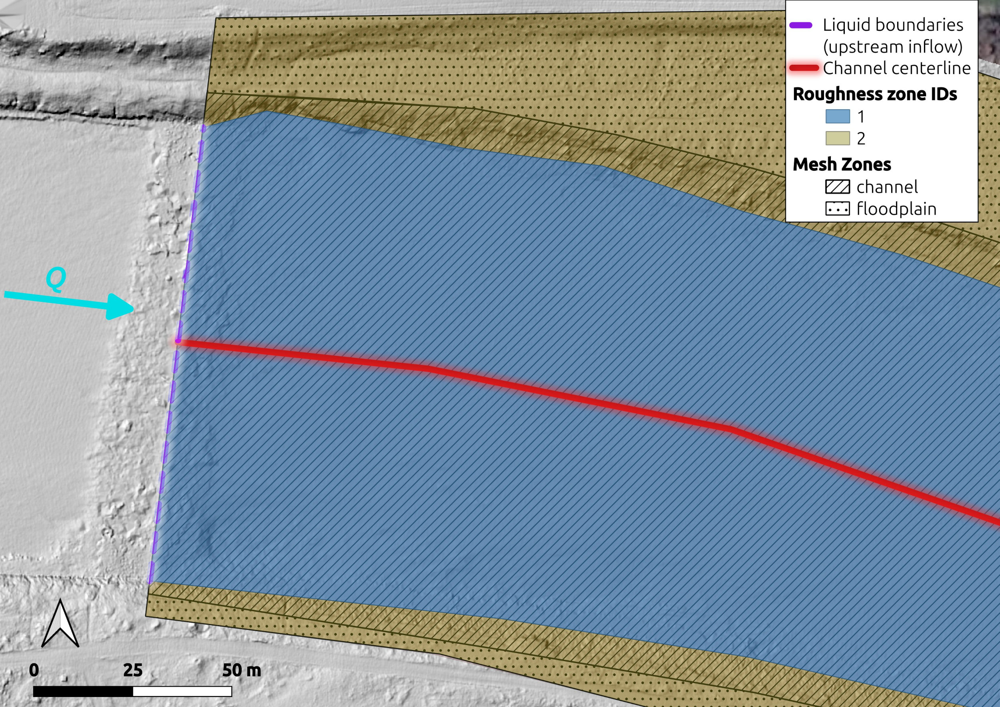

.. _help-case-setup:

aXqua case setup
================

An **aXqua case** is the complete description of one river reach for one modeling task: the terrain, the boundaries of the model, the roughness of the riverbed, the settings of the simulation, and the field measurements for the calibration. The description is stored in one **case file**, whose name ends with ``.axq-case``. All simulation steps read this file, so that a 2D TELEMAC model and a 3D OpenFOAM model of the same reach use the same input.

A case file contains nothing that is specific to a computer. Where the simulation software is installed is stored in the profile of the computer (:ref:`plugin-profile`). A case folder can therefore be copied to another computer, or published together with a study, and used there without changes.

.. _help-example-case:

**Example case.** A complete case is available for trying out every step before a case of one's own is set up. It describes a braided reach of the Isar River of 6.6 ha at a discharge of 2.4 m³/s, with a coarse mesh, so that the model is built in one minute and a steady simulation takes about two minutes. The example is a folder that contains the case file, the input data in the subfolder ``user-sources/``, and a guide (``README.md``) that explains every step from the build to the loading of the result in QGIS. The folder has a size of about 6 MB. Its terrain model is cut to the outline of the model, which is all that aXqua reads of a terrain model. The velocity measurements of the reach are not part of the example yet, so that the example does not include a calibration.

On the *Case Setup* tab, *Example case...* opens a window that lists the available examples. Select the folder in which the folder of the example is to be created and click *Download*. The example is then added to the list of cases, and the next step is *Build* on the *Preprocessing* tab. In a terminal, the following command does the same:

.. code-block:: text

   axqua example get --folder <folder>

The example is not part of the installed program. It is downloaded from the aXqua repository on GitHub. Its input data may be reused and adapted for any purpose, provided that aXqua is cited (Creative Commons Attribution 4.0 International License). The file ``LICENSE.md`` in the folder of the example states the terms and the citation. A folder with the name of the example that already exists is never overwritten, because it may contain results. Delete the folder, or select another one, to download the example again.

**In the plugin.** The *Case Setup* tab lists the cases of the project. *New case...* creates a case file and opens it in the case editor, *Add case...* adds an existing case file, and *Edit case...* opens the active case in the editor. The editor shows one block of the case at a time. The blocks are listed on the left in the order of the subsections below. In each block, the editor shows the settings that every case needs and all settings that the case file already contains. Every other setting of the block is added with *Add setting...*. A tooltip explains each setting.

Nothing has to be typed that can be selected. Every file has a button that opens a file dialog, and the button *Layers* offers the layers that are open in QGIS. A file in or near the case folder is entered with a path relative to the case file, so that the case can be moved together with its data.

The editor has three buttons at the bottom right. *Save* writes the case file and checks it, and the window stays open. *Cancel* discards the changes since the last save and closes the window. *Exit* closes the window and asks first if there are changes that were not saved. The check never prevents saving, because a case is incomplete while it is being set up. It marks each setting that is not in order with a triangle, orange for a warning and dark red for an error, and marks the block in the list on the left. A click on a triangle opens the message with its remedy (:doc:`../troubleshooting/warnings`, :doc:`../troubleshooting/errors`). The button *Check* on the *Case Setup* tab runs the same check without opening the editor.

Saving from the editor rewrites the case file from its settings. Comments of a case file that was written by hand are not kept. The original is preserved as ``<name>.bak`` the first time the editor saves.

**In a text editor.** The case file is a text file in YAML format. Each block of the file is explained in one subsection below. A commented template is provided in the folder ``cases/case-template/`` of the repository. Copy this folder to start a new case, and rename the case file. The command ``axqua check <case-file>`` reports everything that is not in order.

Case files of earlier aXqua versions are named ``case-config.yml`` and may contain the location of the simulation software. They are still read. The following command writes a case file of the current type next to such a file:

.. code-block:: text

   axqua migrate case-config.yml --to-case

A minimal case file looks as follows:

.. code-block:: yaml

   project:
     name: my-reach
     crs_epsg: 25832
   telemac:
     solver: telemac2d
     n_processors: 4
   geodata:
     dem_initial: user-sources/geodata/dem.tif
     boundary: user-sources/geodata/roi.gpkg
   boundaries:
     liquid_boundaries: user-sources/geodata/liquid-boundaries.gpkg
     prescribed_flowrate: 47.2      # discharge at the inflow [m3/s]
     outflow_condition: elevation
     prescribed_elevation: 379.5    # water surface elevation at the outflow [m]

.. _case-project:

Project paths
-------------

The ``project`` block names the case, defines its coordinate reference system and states where aXqua writes its files.

.. code-block:: yaml

   project:
     name: my-reach
     crs_epsg: 25832          # metric coordinate reference system (here: ETRS89 / UTM 32N)
     sim_dir: axqua-case      # folder for everything that aXqua produces

A case folder has two parts with different roles. The folder ``user-sources/`` contains the input data, such as terrain models, vector layers and measurements. aXqua reads these files and never changes them. The folder ``axqua-case/`` receives everything that aXqua produces, in one subfolder per workflow step:

.. code-block:: text

   my-reach/
     my-reach.axq-case            the case file
     user-sources/                input data (read only)
     axqua-case/
       preprocessing/             clipped terrain models, compiled measurements
       simulation/                the TELEMAC model and its results
       openfoam/                  the OpenFOAM model and its results
       postprocessing/            mesh convergence studies, figures
       calibration-validation/    input and output of the calibration

Because of this separation, a case can be rebuilt from its inputs at any time, and the folder ``axqua-case/`` can be deleted without losing data that cannot be reproduced.

All paths in the case file are interpreted relative to the folder of the case file. ``crs_epsg`` must be a metric (projected) coordinate reference system. Input layers may use any other reference system, because aXqua converts them when it reads them.

.. _case-geodata:

Geodata
-------

The ``geodata`` block lists the terrain model and the vector layers that describe the reach. The file names are free. What matters is the geometry type and the attribute fields of each layer.

.. list-table::
   :header-rows: 1
   :widths: 22 14 28 36

   * - Entry
     - Geometry
     - Attribute fields
     - Purpose
   * - ``dem_initial`` (required)
     - raster
     - none
     - Digital elevation model (DEM) of the riverbed and the floodplains.
   * - ``boundary`` (required)
     - one polygon
     - none
     - Region of interest. The model covers the area inside this polygon.
   * - ``mesh_zones``
     - polygons
     - ``Zone Name``, ``Max Edge Length (m)``
     - Areas of equal mesh resolution. The zone name must contain ``channel``, ``floodplain`` or ``refinement`` (:ref:`case-mesh`).
   * - ``channel_centerline``
     - one line
     - none
     - Course of the main channel. Mesh cells in the channel are stretched along this line.
   * - ``roughness_zones``
     - polygons
     - ``Zone ID`` (integer)
     - Areas of equal roughness (:ref:`case-roughness`).
   * - ``roughness_table``
     - table (CSV)
     - ``zone_id``, ``ks``
     - Roughness value of each zone.
   * - ``structures``
     - polygons or lines
     - ``Type``, ``Crest (m)`` or ``Height (m)``, ``Width (m)``
     - Dams, weirs, walls and buildings that the DEM does not contain.
   * - ``control_sections``
     - lines
     - a name field
     - Cross sections at which the discharge is evaluated after a simulation.
   * - ``dem_target``
     - raster
     - none
     - DEM of a later survey, for morphodynamic simulations (:ref:`case-morphodynamics`).

The inflow and outflow lines also are a vector layer, which belongs to the boundaries (:ref:`case-boundaries`).

The vector layers have to fit together: the mesh zones cover the region of interest without gaps, the inflow and outflow lines lie on its outline, and the centerline runs inside the channel zone. Draw the layers in QGIS on top of a **hillshade** of the DEM, which shows banks, gravel bars and structures clearly (*Processing Toolbox > GDAL > Raster analysis > Hillshade*).

   Mesh zones, roughness zones, the inflow line and the channel centerline at the upstream end of a model, drawn over a hillshade of the DEM.

To place a small refinement zone inside a larger zone, cut a hole of the same shape into the larger polygon with the QGIS tool *Add Ring* (*Advanced Digitizing Toolbar*), so that the two polygons do not overlap.

**Structures** are drawn as ordinary features. A line with a ``Width (m)`` describes a wall or the crest of a dam. A polygon describes a building or a pier. ``Crest (m)`` gives a horizontal crest at an absolute elevation, and ``Height (m)`` gives a crest at a constant height above the ground. Structures that water can pass over (dam, weir, embankment) raise the riverbed to the crest. Structures that are never overtopped (wall, building, pier) are removed from the flow area. The distinction is taken from the text in the ``Type`` field.

For a morphodynamic simulation, aXqua can compute the elevation change between two surveys itself from ``dem_initial`` and ``dem_target`` (:ref:`case-morphodynamics`).

.. _case-surfaces:

**Designed structures from CAD drawings.** A structure that exists as a construction drawing and not as a survey, such as a fish pass or a flume, can be supplied as a set of STL files. The ``surfaces`` block names each file and states its role. aXqua converts the files into the ordinary inputs of a case (a DEM, the region of interest, the inflow and outflow lines, structures and roughness zones), so that no entries are required under ``geodata`` for them.

.. code-block:: yaml

   surfaces:
     resolution: 0.05     # [m] cell size of the DEM that is created
     scale: 0.001         # the drawing is in millimeters
     parts:
       - {file: user-sources/cad/bed.stl,    role: bed, zone_id: 1, ks: 0.08}
       - {file: user-sources/cad/walls.stl,  role: wall}
       - {file: user-sources/cad/inlet.stl,  role: inflow}
       - {file: user-sources/cad/outlet.stl, role: outflow}

The roles are ``bed`` (terrain, at least one file), ``wall`` (structures that are never overtopped), ``inflow`` and ``outflow`` (open boundaries), ``roi`` (outline of the model) and ``ignore``. A ``bed`` file with a ``zone_id`` and a ``ks`` value also defines a roughness zone. The command ``axqua surface <case-file>`` performs the conversion alone, so that the result can be inspected in QGIS before the model is built. Because a DEM stores one elevation per location, overhanging parts of a drawing cannot be represented. aXqua reports their share. Select the ``resolution`` fine enough for the thinnest wall of the structure.

.. _case-boundaries:

Boundaries
----------

At the boundaries of the model, the user states what the river does. For the subcritical flow that prevails in most rivers, the model requires the **discharge at the inflow** and the **water surface elevation at the outflow**. The discharge determines how much water enters. The downstream water level determines how deep and how fast the water leaves the model.

.. code-block:: yaml

   boundaries:
     liquid_boundaries: user-sources/geodata/liquid-boundaries.gpkg
     prescribed_flowrate: 47.2       # [m3/s]
     outflow_condition: elevation    # elevation | stage_discharge | free
     prescribed_elevation: 379.5     # [m]

``liquid_boundaries`` is a line layer with one line per inflow and per outflow cross section. An attribute field named ``Type (inflow/outflow)`` contains the word ``inflow`` or ``outflow`` for each line. All parts of the model outline that are not covered by such a line are closed walls.

``outflow_condition`` selects how the downstream water level is defined:

``elevation`` (default)
    A constant water surface elevation, given by ``prescribed_elevation``.
``stage_discharge``
    The water surface elevation is read from a rating curve for the simulated discharge. The curve is a table with the columns ``Q`` and ``WSE``, named by ``stage_discharge``. If no measured curve is available, aXqua estimates one from the channel width, the bed slope and the roughness at the outflow line.
``free``
    No water level is prescribed. This choice is suited for an outflow over a drop or a weir.

For a simulation with a discharge that varies in time, ``inflow`` names a table with a time column and a discharge column.

**Gauge data.** The script ``scripts/gauge_data.py`` retrieves discharge time series and rating curves of river gauges and saves them in the format that aXqua reads. It supports the gauges of the Bavarian flood information service (HND) and of the United States Geological Survey (USGS). It opens in a web browser and requires the package ``streamlit`` (``pip install ".[gui]"``). Start it from the repository folder, paste the address or the number of a gauge, and save the two tables into ``user-sources/``:

.. code-block:: bash

   python scripts/gauge_data.py

The exported discharge series is the ``inflow`` table, and the exported rating curve is the ``stage_discharge`` table. Enter the elevation of the gauge zero to convert the gauge reading into an absolute water surface elevation, and verify that this elevation and the DEM refer to the same height system.

.. _case-initialization:

Initialization
--------------

A simulation requires a state from which it starts. The ``initialization`` block offers two choices.

**Dry start (default).** The riverbed is dry, except for a short stretch at the inflow that is filled with water to the depth ``dry_start_depth`` (default 0.5 m). The inflowing discharge then fills the reach from upstream. This start requires no assumption about the water level, but the model has to simulate the filling of the reach.

**Pre-wetted channel.** When ``prewet_depth`` is set, the channel zones start with water. aXqua estimates the water level at cross sections along the centerline for the discharge of the case and fills the channel to 70 % of this level (``prewet_fill``). The lower filling is intended: a channel with too little water fills within seconds, whereas surplus water on flat ground may remain as a thin film until the end of the simulation, because a 2D model has neither infiltration nor evaporation. The mesh convergence study uses the pre-wetted start to save computing time.

.. code-block:: yaml

   initialization:
     dry_start_depth: 0.5     # [m] water depth of the filled stretch at the inflow
     # prewet_depth: 0.5      # [m] activates the pre-wetted start

.. _case-mesh:

Mesh configuration
------------------

The computational mesh divides the region of interest into triangles. Small triangles resolve the flow in more detail but increase the computing time strongly. aXqua therefore uses different resolutions in different zones:

* ``channel`` zones receive triangles that are stretched along the centerline, because the flow varies less along the channel than across it;
* ``floodplain`` zones receive larger triangles of regular shape;
* ``refinement`` zones receive small triangles of regular shape, for example around a structure.

The edge length of each zone is read from the field ``Max Edge Length (m)`` of the mesh zone layer, so that the resolution is set in QGIS. The ``mesh`` block provides the values that apply where this field is empty:

.. code-block:: yaml

   mesh:
     channel_size: 0.5         # [m] edge length across the channel
     floodplain_size: 1.5      # [m]
     refinement_size: 0.5      # [m]
     channel_anisotropy: 4.0   # ratio of the edge length along and across the channel
     growth_ratio: 1.2         # largest size ratio of neighboring triangles

The default values produce a fine mesh. A reach of 0.3 km² then has several hundred thousand triangles. Use larger edge lengths while boundaries and roughness are still being checked, and refine afterwards. The mesh convergence study determines which resolution is sufficient (:doc:`mesh-convergence`).

Without mesh zones and a centerline, aXqua creates a mesh of uniform resolution (``default_size``).

.. _case-roughness:

Wall roughness
--------------

Flowing water experiences friction forces at the riverbed and the banks. These forces depend on the roughness of the wetted surfaces, and they determine the water depth for a given discharge. Roughness is therefore the most important parameter of a hydraulic model, and it is the parameter that is usually calibrated.

aXqua describes roughness by the **equivalent sand roughness** :math:`k_s` (in meters) after Nikuradse, which is a length of the order of the coarse grains of the bed. Each polygon of the layer ``roughness_zones`` carries an integer ``Zone ID``, and the table ``roughness_table`` assigns a :math:`k_s` value to each ID:

.. code-block:: text

   zone_id,ks
   1,0.2
   2,0.5

In this example, zone 1 is the gravel bed of the channel and zone 2 is a vegetated floodplain. The ``friction`` block contains the roughness of the closed walls at the model outline and the values that apply without roughness zones:

.. code-block:: yaml

   friction:
     roughness_law: 5              # 5 = Nikuradse (ks), 4 = Manning (n), 3 = Strickler
     boundary_law: 3
     boundary_coefficient: 38.0

The :math:`k_s` values of the zones are starting values. The calibration adjusts them within the limits set by the user (:doc:`calibration-validation`).

.. _case-hydraulics:

Hydraulic simulation
--------------------

The ``hydrodynamics`` block controls the hydraulic simulation with TELEMAC. Most entries have default values that are suited for river reaches with dry and wet areas. The entries that a user typically sets are:

.. code-block:: yaml

   hydrodynamics:
     duration: 7200           # [s] simulated time
     turbulence_model: auto   # auto, or the number of a TELEMAC turbulence model
     flux_tolerance: 1.0e-3   # accepted relative difference of inflow and outflow

``duration`` has to be long enough for the reach to fill and for the flow to become steady. A steady state is reached when the same discharge leaves the model that enters it. aXqua evaluates this balance after each run and compares the relative difference with ``flux_tolerance``. The default of 0.1 % is far smaller than the uncertainty of a discharge measurement.

With ``turbulence_model: auto``, aXqua selects the turbulence model from the mesh resolution relative to the water depth. The time step is adapted automatically during the run, so that the simulation remains stable (``desired_courant``).

The number of processor cores is a property of the computer and is set in its profile (``mpi_processes``, :ref:`solver-bindings`). Where the profile names no number, ``telemac.n_processors`` of the case file applies. The settings of the 3D simulation with OpenFOAM are described in :ref:`preprocessing-openfoam-choices`.

.. _case-morphodynamics:

Morphodynamic simulation
------------------------

A morphodynamic simulation computes sediment transport and the resulting change of the riverbed (:doc:`morphodynamic-simulations`). It is activated in the ``morphodynamics`` block, which describes the sediment:

.. code-block:: yaml

   morphodynamics:
     enabled: true
     bedload: true
     suspended_load: false
     sediment_classes:             # one entry per grain size class
       - {diameter: 0.0008, density: 2650, shields: 0.047}
       - {diameter: 0.004,  density: 2650, shields: 0.047}
     active_layer_thickness: 0.1   # [m]

Each sediment class is defined by its grain diameter (in meters), its density and its critical Shields parameter, which is the dimensionless shear stress at which grains start to move.

The measured riverbed change serves as the reference for the calibration of a morphodynamic model. It is the difference of two terrain surveys, which is called a **DEM of difference** (DoD). With the following block, aXqua computes the DoD from ``geodata.dem_target`` and ``geodata.dem_initial``:

.. code-block:: yaml

   dem_of_difference:
     enabled: true
     uncertainty_initial: 0.10   # [m] vertical accuracy of the first survey
     uncertainty_target: 0.05    # [m] vertical accuracy of the second survey
     confidence_level: 0.95

Elevation changes that are smaller than the combined uncertainty of the two surveys cannot be distinguished from measurement error. aXqua removes them from the DoD. The limit is called the level of detection and results from the two accuracy values and the confidence level. Alternatively, ``min_lod`` sets the limit directly.
