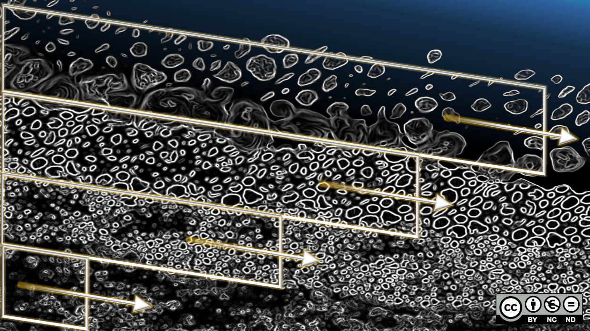

.. _help-morphodynamics:

Morphodynamic simulations
=========================

A morphodynamic simulation computes how flowing water moves sediment and how the riverbed changes as a result. It extends a hydraulic simulation: in every time step, the flow moves sediment, the bed elevation is updated, and the changed bed in turn alters the flow.

.. _morphodynamics-concept:

Concept
-------

**Transport modes.** Flowing water moves sediment in two ways. **Bedload** consists of grains that roll, slide or jump along the bed. It is the dominant mode for gravel and coarser material. **Suspended load** consists of finer grains that turbulence keeps afloat in the water column. Simulating both modes is computationally expensive, so that only the dominant mode should be activated:

* a gravel or cobble bed with less than about 5 to 10 % sand: bedload only;
* sediment that is generally finer than 1 mm, as in reservoirs: suspended load only;
* mixtures with a substantial sand content: both modes;
* cohesive sediment (finer than 0.06 mm): suspended load is required.

**Start of motion.** A grain starts to move when the shear stress that the flow exerts on the bed exceeds a critical value. This threshold is expressed by the dimensionless critical Shields parameter, which has to be defined for each grain size class. Because it is uncertain, it is a typical calibration parameter.

**Bed change.** The bed elevation changes wherever the sediment transport rate changes along the flow path. If more sediment enters a location than leaves it, sediment deposits and the bed rises. In the opposite case, the bed erodes. This sediment mass balance is called the Exner equation (Exner 1925).

**Active layer.** Only the uppermost layer of the riverbed takes part in sediment transport at a given moment. This layer is called the active layer. It supplies the sediment that is eroded and receives the sediment that is deposited. Its thickness is a multiple of the characteristic grain diameter. The layers below form the substratum, which is only reached when the active layer is eroded. The distinction matters in rivers with an armored bed, where a coarse surface layer protects finer sediment underneath (Hirano 1971): as long as the armor layer is intact, little sediment moves, and once it breaks, the finer substratum is rapidly eroded.

   The active layer at the surface of the riverbed is in contact with the flow. The substratum layers below can have different grain size compositions. Figure by Schwindt (`hydro-informatics.com <https://hydro-informatics.com>`_, CC BY-NC-ND), conceptually after du Boys (1879) and Church and Haschenburger (2017).

**Reference data.** A morphodynamic model is assessed against measured bed changes, which are obtained as the difference of two terrain surveys (:ref:`case-morphodynamics`).

.. _help-morphodynamics-telemac:

TELEMAC-GAIA Setup
------------------

`GAIA <http://www.opentelemac.org/>`_ is the sediment transport module of TELEMAC. When ``morphodynamics.enabled`` is set in the case file, the preprocessing writes a GAIA steering file (``gaia.cas``) next to the TELEMAC model and couples it to the hydraulic simulations.

.. list-table::
   :header-rows: 1
   :widths: 34 66

   * - Entry in ``morphodynamics``
     - Meaning
   * - ``bedload``, ``suspended_load``
     - Transport modes to be simulated.
   * - ``sediment_classes``
     - One entry per grain size class with ``diameter`` [m], ``density`` [kg/m³] and the critical Shields parameter ``shields``.
   * - ``bedload_formula``
     - Number of the bedload transport formula in GAIA (1 is the formula of Meyer-Peter and Müller).
   * - ``active_layer_thickness``
     - Thickness of the active layer [m]. A common choice is three times the diameter of the coarse grains.
   * - ``bed_layers``
     - Number of substratum layers.
   * - ``slope_effect``, ``friction_angle``
     - Deflection of the bedload on a laterally inclined bed, and the angle of repose of the sediment [degrees].
   * - ``secondary_currents``
     - Deflection of the bedload by the spiral flow in river bends.
   * - ``prescribed_solid_discharges``
     - Sediment supply at each open boundary.
   * - ``morphological_factor``
     - Factor by which the bed change is accelerated relative to the flow. A value of 10 means that one simulated hour represents ten hours of bed change. Use values above 1 with care, and only for slowly varying discharges.

Significant bed changes occur during floods. A morphodynamic simulation is therefore usually run with a discharge time series. Define the time series under ``boundaries.inflow``, enable ``morphodynamics``, repeat the preprocessing and start the unsteady run (:ref:`hydraulics-hotstarts`):

.. code-block:: text

   axqua <case-file>
   axqua submit <case-file> --kind unsteady

The GAIA results are written next to the hydraulic results. The variable for the bed change is the cumulated bed evolution.

.. note::

   The grain size classes are entered by hand. The automatic derivation of the classes from measured grain size distributions is not yet available in this version.

.. _help-morphodynamics-openfoam:

OpenFOAM Setup
--------------

.. note::

   Morphodynamic simulations with OpenFOAM are not yet available in this version. They are planned on the basis of the solvers ``sediDriftFoam`` and ``sediDriftFoam2`` of Nils Reidar B. Olsen (`documentation <https://www.pvv.ntnu.no/~nilsol/sediDriftFoam/>`_).

References
~~~~~~~~~~

Church, M., and Haschenburger, J. K. (2017). "What is the 'active layer'?" *Water Resources Research*, 53, 5-10. `doi:10.1002/2016WR019675 <https://doi.org/10.1002/2016WR019675>`_

Du Boys, P. (1879). "Etudes du régime du Rhône et l'action exercée par les eaux sur un lit à fond de graviers indéfiniment affouillable." *Annales des Ponts et Chaussées*, 5(18), 141-195.

Exner, F. M. (1925). "Über die Wechselwirkung zwischen Wasser und Geschiebe in Flüssen." *Akademie der Wissenschaften in Wien, math.-naturw. Klasse, Sitzungsberichte, Abt. IIa*, 134, 165-203.

Hirano, M. (1971). "River-bed degradation with armoring." *Proceedings of the Japan Society of Civil Engineers*, 1971(195), 55-65. `doi:10.2208/jscej1969.1971.195_55 <https://doi.org/10.2208/jscej1969.1971.195_55>`_
